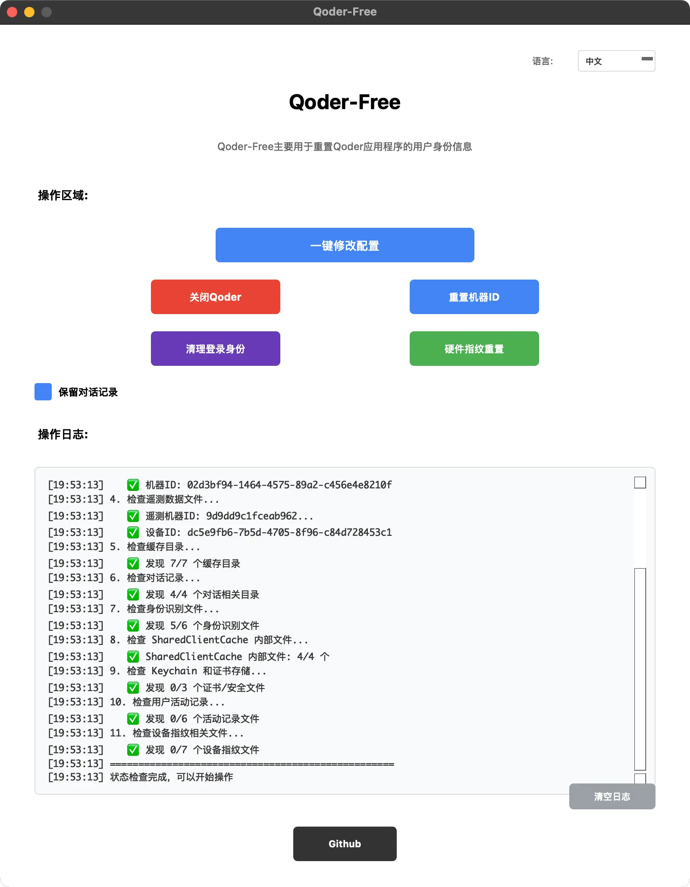

# Qoder-Free

一个用于重置 Qoder 应用程序用户身份信息的现代化图形界面工具。


## 📋 目录

- [功能特性](#功能特性)
- [系统要求](#系统要求)
- [安装指南](#安装指南)
- [使用方法](#使用方法)
- [功能详解](#功能详解)
- [界面说明](#界面说明)
- [技术细节](#技术细节)
- [故障排除](#故障排除)
- [开发指南](#开发指南)
- [更新日志](#更新日志)

## ✨ 功能特性

- � **重置机器ID** - 生成全新的机器标识符
- 📊 **重置遥测数据** - 重置应用程序的遥测和设备ID
- 🧹 **智能缓存清理** - 清理应用缓存但保护重要数据
- 🔥 **深度身份清理** - 清除所有网络状态、Cookie和本地存储（新增）
- 💬 **对话记录管理** - 可选择保留或清除聊天历史记录
- 🖥️ **现代化界面** - 基于PyQt5的美观图形界面
- 📝 **实时日志** - 详细的操作日志和状态监控
- 🔍 **状态检测** - 自动检测Qoder运行状态和数据完整性
- ⚡ **一键操作** - 支持一键完成所有重置操作
- 🛡️ **安全保护** - 操作前确认，防止误操作
- 🎯 **强化清理** - 清理SharedClientCache、网络指纹等深层身份信息

### 🔍 深度身份识别清理

**为什么需要深度清理？**
基础重置工具只处理了基本的身份文件，但遗漏了以下关键身份识别信息：

#### 1. 网络层身份信息
- **Network Persistent State** - 网络服务器连接历史和网络指纹
- **Cookies & Cookies-journal** - 浏览器 Cookie 数据库
- **TransportSecurity** - 传输安全状态，包含 HSTS 等信息

#### 2. 本地存储身份信息
- **Local Storage/leveldb** - 本地存储数据库
- **SharedStorage & SharedStorage-wal** - 共享存储数据
- **WebStorage** - Web 存储数据
- **Session Storage** - 会话存储数据

#### 3. 系统级身份信息
- **SharedClientCache/.info** - 语言服务器信息文件
- **SharedClientCache/mcp.json** - MCP 配置文件
- **SharedClientCache/index/** - 索引数据目录
- **SharedClientCache/cache/** - 共享缓存数据

#### 4. 其他潜在识别信息
- **Trust Tokens & Trust Tokens-journal** - 信任令牌
- **Preferences** - 用户偏好设置
- **Shared Dictionary** - 共享字典
- **Service Worker** - 服务工作线程数据
- **Crashpad** - 崩溃报告（可能包含设备信息）
- **languagepacks.json** - 语言包配置
- **code.lock** - 代码锁文件
- ***.sock** - Socket 文件

## �️ 系统要求

- **操作系统**: macOS 10.14+ 或 Windows 10+
- **Python**: 3.6 或更高版本
- **依赖库**: PyQt5
- **磁盘空间**: 至少 50MB 可用空间
- **权限**: 
  - macOS: 对 `~/Library/Application Support/Qoder` 的读写权限
  - Windows: 对 `%APPDATA%\Qoder` 的读写权限

## 📦 安装指南

### 方法一：直接运行（推荐）

1. **克隆或下载项目**
   ```bash
   git clone <repository-url>
   cd qoder-free
   ```

2. **安装依赖**
   ```bash
   pip3 install PyQt5
   ```

3. **运行程序**
   ```bash
   python3 qoder_reset_gui.py
   ```

### 方法二：使用启动脚本

**macOS/Linux:**
```bash
chmod +x start_gui.sh
./start_gui.sh
```

**Windows:**
```cmd
start_gui.bat
```


## 🚀 使用方法

### 基本使用流程

1. **启动应用**
   - 双击运行 `qoder_reset_gui.py`
   - 或使用终端命令启动

2. **查看状态**
   - 程序启动后会自动检测当前状态
   - 查看日志区域了解系统状态

3. **选择操作**
   - 勾选"保留对话记录"（默认勾选）
   - 选择具体的重置操作

4. **执行重置**
   - 点击相应按钮执行操作
   - 查看日志确认操作结果

### 快速开始

```bash
# 1. 安装依赖
pip3 install PyQt5

# 2. 运行程序
python3 qoder_reset_gui.py

# 3. 在界面中点击"一键修改所有配置"
```

## 🔧 功能详解

### 主要功能按钮

1. **关闭Qoder**
   - 检查Qoder进程运行状态
   - 提示用户手动关闭应用程序
   - 确保重置操作的安全性

2. **重置机器ID**
   - 生成新的UUID作为机器标识符
   - 修改 `~/Library/Application Support/Qoder/machineid` 文件
   - 让Qoder识别为新设备

3. **重置遥测数据**
   - 重置 `telemetry.machineId` 和 `telemetry.devDeviceId`
   - 修改 `storage.json` 文件中的遥测配置
   - 清除设备追踪信息

4. **一键修改所有配置**
   - 综合执行所有重置操作
   - 根据"保留对话记录"选项处理聊天数据
   - 清理应用缓存和临时文件

### 对话记录管理

- **保留对话记录**（默认勾选）
  - 保留 `User/workspaceStorage/.../chatSessions/`
  - 保留 `User/workspaceStorage/.../chatEditingSessions/`
  - 保留 `User/History/` 目录
  - 只清理缓存和身份信息

- **清除对话记录**（取消勾选）
  - 删除所有对话会话数据
  - 清除聊天编辑会话
  - 移除历史记录
  - 清理会话存储

## 🖼️ 界面说明

### 界面截图



## 🔧 技术细节

### 文件结构

```
qoder-free/
├── qoder_reset_gui.py          # 主程序文件（PyQt5界面）
├── start_gui.sh               # 启动脚本
└── README.md                  # 完整说明文档
```

### 核心技术

- **GUI框架**: PyQt5 - 现代化跨平台GUI框架
- **进程检测**: 使用 `pgrep` 命令检测Qoder运行状态
- **文件操作**: Python pathlib 进行安全的文件路径操作
- **JSON处理**: 标准库json模块处理配置文件
- **UUID生成**: 使用uuid4()生成随机标识符
- **哈希计算**: SHA256算法生成遥测机器ID

### 操作的文件和目录

```
~/Library/Application Support/Qoder/
├── machineid                           # 机器ID文件
├── User/globalStorage/storage.json     # 遥测数据配置
├── User/workspaceStorage/              # 工作区存储（包含对话记录）
├── User/History/                       # 历史记录
├── Session Storage/                    # 会话存储
├── Cache/                             # 应用缓存
├── blob_storage/                      # Blob存储
├── Code Cache/                        # 代码缓存
├── SharedClientCache/                 # 共享客户端缓存
├── GPUCache/                          # GPU缓存
├── DawnGraphiteCache/                 # Dawn图形缓存
└── DawnWebGPUCache/                   # Dawn WebGPU缓存
```

## 🚨 故障排除

### 常见问题

#### 1. PyQt5安装失败
```bash
# 如果pip安装失败，尝试使用conda
conda install pyqt

# 或者使用homebrew安装Python和PyQt5
brew install python-tk
pip3 install PyQt5
```

#### 2. 权限不足错误
```bash
# 确保对Qoder目录有读写权限
ls -la ~/Library/Application\ Support/Qoder/

# 如果权限不足，可以尝试修复权限
chmod -R u+rw ~/Library/Application\ Support/Qoder/
```

#### 3. Qoder目录不存在
- 确保已安装Qoder应用程序
- 至少运行过一次Qoder以创建配置目录
- 检查Qoder是否安装在正确位置

#### 4. 界面文字不可见
- 程序已自动处理macOS深色模式兼容性
- 如果仍有问题，尝试切换系统主题
- 重启应用程序

#### 5. 对话框按钮不可见
- 程序已设置全局样式确保按钮可见
- 如果问题持续，请检查系统PyQt5版本

### 日志分析

程序启动时会显示详细的状态检查信息：

```
[时间] Qoder-Free 重置工具已启动
[时间] ================================================
[时间] 1. 检查Qoder进程状态...
[时间]    ✅ Qoder未运行
[时间] 2. 检查Qoder目录...
[时间]    ✅ Qoder目录存在
[时间] 3. 检查机器ID文件...
[时间]    ✅ 机器ID: xxxxxxxx-xxxx-xxxx-xxxx-xxxxxxxxxxxx
[时间] 4. 检查遥测数据文件...
[时间]    ✅ 遥测机器ID: xxxxxxxxxxxxxxxx...
[时间]    ✅ 设备ID: xxxxxxxx-xxxx-xxxx-xxxx-xxxxxxxxxxxx
[时间] 5. 检查缓存目录...
[时间]    ✅ 发现 7/7 个缓存目录
[时间] 6. 检查对话记录...
[时间]    ✅ 发现 4/4 个对话相关目录
[时间] ================================================
[时间] 状态检查完成，可以开始操作
```

## 👨‍💻 开发指南

### 代码结构

```python
class QoderResetGUI(QMainWindow):
    def __init__(self):
        # 初始化界面

    def init_ui(self):
        # 创建界面元素

    def initialize_status_check(self):
        # 启动时状态检查

    def check_qoder_running(self):
        # 检查Qoder进程

    def close_qoder(self):
        # 关闭Qoder功能

    def reset_machine_id(self):
        # 重置机器ID

    def reset_telemetry(self):
        # 重置遥测数据

    def one_click_reset(self):
        # 一键重置功能

    def perform_full_reset(self, preserve_chat=True):
        # 执行完整重置

    def clear_chat_history(self, qoder_support_dir):
        # 清除对话记录
```

### 自定义修改

如果需要修改程序行为，可以编辑以下部分：

1. **修改界面样式**: 编辑各个组件的 `setStyleSheet()` 调用
2. **添加新功能**: 在 `init_ui()` 中添加新按钮和对应的处理函数
3. **修改重置逻辑**: 编辑 `perform_full_reset()` 函数
4. **更改检测逻辑**: 修改 `initialize_status_check()` 函数

### 测试

建议的测试步骤：

1. **启动测试**: 运行程序确保界面正常显示
2. **功能测试**: 逐一测试各个按钮功能
3. **状态检查**: 验证初始状态检查是否正确
4. **重置测试**: 在测试环境中验证重置功能
5. **日志验证**: 确认操作日志显示正确

## 📝 更新日志

### v2.1.0 - 身份识别修复版本 (最新版本)
- ✨ 新增深度身份清理功能
- 🔧 修复遗漏的关键身份识别文件
- 📈 增强状态检查功能
- 🎨 改进界面布局（2x2 按钮布局）
- 📋 完善日志输出和用户反馈
- 🔍 清除 Network Persistent State、Cookies、SharedStorage 等身份文件
- 🛠️ 清理 SharedClientCache 内部关键文件（.info, mcp.json 等）
- 🧹 清除崩溃报告、Socket 文件等其他身份信息

### v2.0.0
- ✨ 全新PyQt5界面，替代tkinter
- 🔧 修复对话框文字不可见问题
- 📝 添加自动滚动日志显示
- 💬 精确的对话记录保护机制
- 🔍 启动时自动状态检查
- 🎨 现代化界面设计，符合原型图要求

### v1.x.x (历史版本)
- 基于tkinter的图形界面
- 基本的重置功能
- 简单的日志显示

## ⚠️ 注意事项

1. **使用前备份**: 建议在使用前备份重要的Qoder配置和数据
2. **关闭应用**: 执行重置操作前必须完全关闭Qoder应用程序
3. **重新登录**: 重置后需要重新登录Qoder账户
4. **数据丢失**: 取消勾选"保留对话记录"将永久删除所有聊天历史
- ✅ **系统兼容**: 目前支持 macOS 和 Windows 系统

## 📄 许可证

本项目仅供学习和研究使用。请遵守相关法律法规和软件使用协议。

## 🤝 贡献

欢迎提交Issue和Pull Request来改进这个项目。

## 📞 支持

如果遇到问题，请：
1. 查看故障排除部分
2. 检查日志输出
3. 提交Issue描述问题

### 环境检查

```bash
# 检查 Python 版本
python3 --version

# 检查 tkinter 是否可用
python3 -c "import tkinter; print('tkinter 可用')"
```

## 📱 现代化界面功能

### 🎨 设计特色
- **紫色横幅标题** - 现代化的顶部设计
- **圆角按钮** - 美观的现代化按钮设计
- **渐变色彩** - 专业的配色方案
- **响应式布局** - 适配不同窗口大小

### 🔧 主要功能
- 🔴 **检查 Qoder 状态** - 一键检查应用程序运行状态
- 🔍 **预览重置操作** - 安全的试运行模式
- ⚡ **执行重置操作** - 一键完成所有重置步骤

### ⚙️ 智能选项
- 💾 **自动备份** - 重置前创建完整备份
- 💬 **会话保留** - 可选择保留对话记录
- 📝 **详细日志** - 实时显示操作进度和结果


## 📋 重置内容

### 会被重置的内容
- ✅ 机器ID (`machineid`)
- ✅ 遥测机器ID (`telemetry.machineId`)
- ✅ 设备ID (`telemetry.devDeviceId`)
- ✅ 缓存目录（Cache, GPUCache 等）
- ✅ 工作区历史
- ✅ 网络状态和Cookie

### 可选择保留的内容
- 🔄 **会话存储** - 对话记录（默认保留）
- 🔄 **本地存储** - 会话数据（默认保留）

### 始终保留的内容
- ✅ 用户设置 (`settings.json`)
- ✅ 应用配置 (`app.json`)
- ✅ 代码片段
- ✅ 扩展

## 🔍 故障排除

### 常见问题

1. **GUI窗口不显示**
   - 确保已安装PyQt5：`pip3 install PyQt5`
   - 尝试使用启动脚本：`./start_gui.sh`
   - 检查终端是否有错误信息

2. **"Qoder 正在运行"**
   - 完全关闭 Qoder 应用程序
   - 使用 Cmd+Q 或从菜单选择退出

3. **"未找到 python3"**
   - 安装 Python 3: https://www.python.org
   - 或使用 Homebrew: `brew install python3`

4. **"tkinter 不可用"**
   - 安装 python-tk: `brew install python-tk`

5. **重置后仍被识别为老用户**
   - 使用“深度身份清理”功能清除所有遗漏的身份识别信息
   - 取消勾选“保留对话记录”以获得最彻底的清理
   - 检查日志确认所有身份文件都被清理
   - 考虑更换网络环境或使用 VPN

6. **网络指纹问题**
   ```bash
   # 清理系统级 DNS 缓存
   sudo dscacheutil -flushcache
   
   # 重置网络设置可能有助于清除网络指纹
   ```

7. **macOS GUI显示问题**
   - 检查Dock中的Python图标并点击激活
   - 确保终端有足够权限运行GUI应用
   - 尝试在不同的终端应用中运行

## 📁 项目文件

```
qoder-free/
├── qoder_reset_gui.py      # 主程序（PyQt5界面，跨平台支持）
├── start_gui.sh           # macOS/Linux 启动脚本
├── start_gui.bat          # Windows 启动脚本
└── README.md              # 完整说明文档
```

## ⚠️ 重要提醒

- **使用前备份**: 推荐使用备份功能保护重要数据
- **关闭应用**: 确保 Qoder 完全关闭后再运行重置
- **合法使用**: 仅用于合法目的，遵守软件使用条款
- **会话保留**: 默认保留对话记录，如需清理可取消勾选

## 🎉 开始使用

### 推荐启动方式：

**macOS/Linux:**
```bash
# 使用启动脚本（推荐）
./start_gui.sh

# 或直接运行
python3 qoder_reset_gui.py
```

**Windows:**
```cmd
# 使用启动脚本（推荐）
start_gui.bat

# 或直接运行
python qoder_reset_gui.py
```

享受全新的 Qoder 使用体验！

---

**版本**: 1.0  
**开发**: [Mr.T](https://www.74110.net/recommendation/qoder-free/) 
**支持**: macOS
